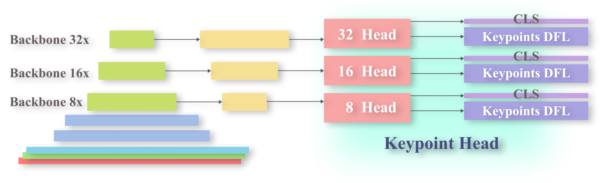

# MultiPoint-Detection

### Statement: 

The term **"keypoint"** in the paper refers to **"multipoints"** in the code. To distinguish it from the joint keypoints provided by Ultralytics, I use **"multipoints"** in the code to represent the new method.


### MultiPoints pipeline




### Install the required packages:

```bash
pip install -e .
pip install wandb opencv-python
```

### Dataset

put the dataset in the following directory:

```
datasets
└── armor
    ├── images
    │   ├── train
    │   └── val
    └── labels
        ├── train
        └── val
```


### Train a model to detect multiple points in an image.

```python
model = YOLO("ultralytics/cfg/models/11/yolo11-multipoints.yaml").load("main/yolo11n.pt")
results = model.train(data="ultralytics/cfg/datasets/armor.yaml", epochs=100, imgsz=640, name="multipoints")
```


### Predict on a single image:

```python
image_path = "datasets/armor/images/val/100021.jpg"
image_name = image_path.split('/')[-1].split('.')[0]

model = YOLO("ultralytics/cfg/models/11/yolo11-multipoints.yaml").load("runs/multipoints/multipoints/weights/last.pt")
result = model.predict(image_path, conf=0.1)
for r in result:
    r.save(f'./outputs/{image_name}.jpg')
```


### Outputs 

Multiple results are stitched together, with arrows added for guidance.


